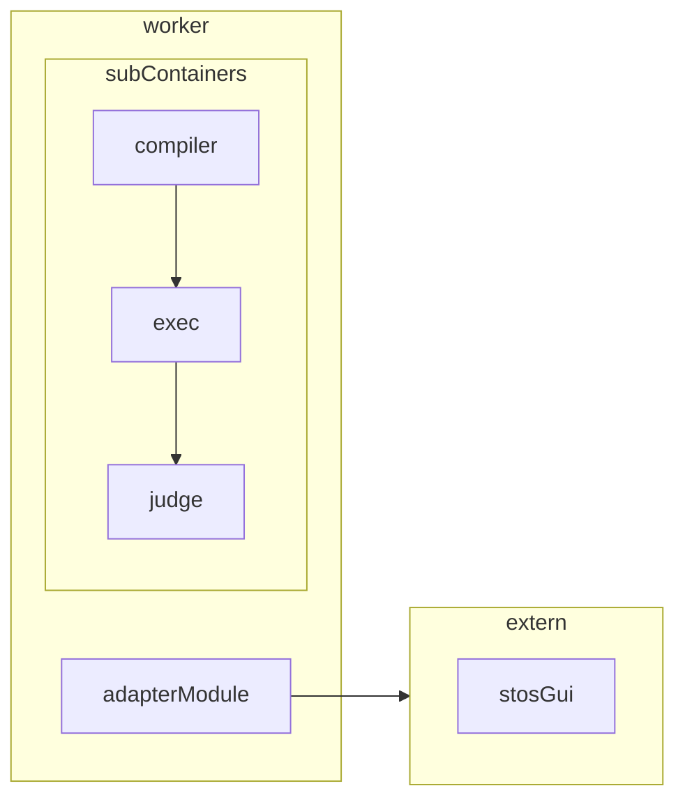
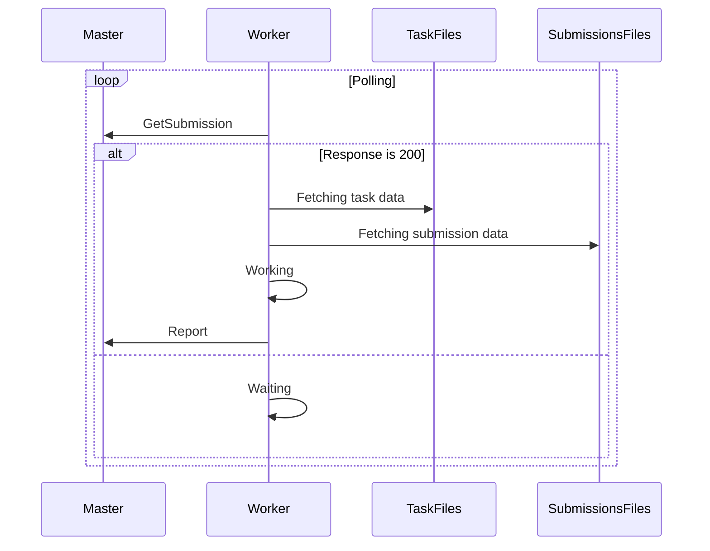

# Fork Projektu_Inżynierskiego-2025

> [!IMPORTANT]
> Work is still in progress. Things can change.

## Overview

This repository contains the source code and configuration for the STOS project, a distributed system for automated task evaluation. The project is organized into several services (master, worker, adapter), shared modules, and configuration files.

## Getting Started

1. **Configure Environment:**  
   Edit [`src/conf/.env`](src/conf/.env) to set environment variables as needed.
   For more information see: [README.md](src/conf/README.md).

2. **Build and Run Services:**  
   Use the provided Docker Compose file:
    ```sh
   docker compose -f src/conf/compose.yml up --build
    ```

# Containers Graph

> [!NOTE]
> Cache and adapter not implemented yet

---

# Sequence Diagram


